# Arc for Kubernetes


## Steps


### Create a new AKS cluster or any CNCF conformant cluster

az group create --name akstestrg --location eastus
az aks create --resource-group akstestrg --name akstestcluster --node-count 3  --generate-ssh-keys
az aks get-credentials --resource-group akstestrg --name akstestcluster --admin --file ~/.kube/config

--- 

### Azure Arc 

https://learn.microsoft.com/en-us/azure/azure-arc/overview  
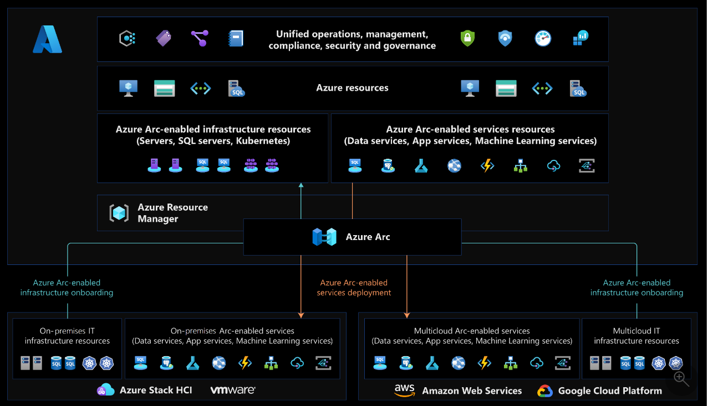

--- 

### Azure Arc for Kubernetes  

https://learn.microsoft.com/en-us/azure/azure-arc/kubernetes/conceptual-agent-overview#deploy-agents-to-your-cluster  
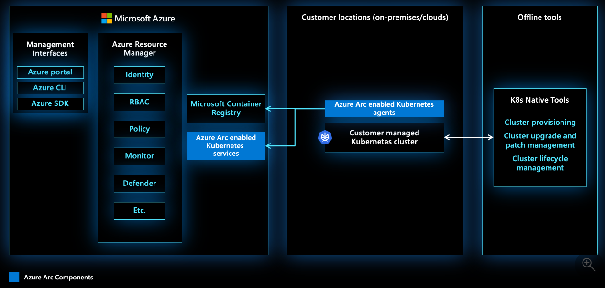

Sequence of steps:  
- Create a Kubernetes cluster on your choice of infrastructure (VMware vSphere, Amazon Web Services, Google Cloud Platform, etc.). The cluster must already exist before you connect it to Azure Arc   
- Onboard a Kubernetes cluster to Azure Arc 
  - Helm chart installed agent initiates connection to Azure Arc service
- An Azure Arc-enabled Kubernetes resource in Azure Resource Manager. Azure tracks this resource as a projection of the customer-managed Kubernetes cluster, not the actual Kubernetes cluster itself.  

--- 

### Install Azure Arc for Kubernetes (Connect your own Kubernetes to Azure Arc)  

Use kubectl config use-context command to set context to the cluster where you want to install Azure Arc. 

Arc is not required for AKS since most of the services are available natively in AKS.  However, Arc can be used to manage AKS clusters.


Following command installs Azure Arc for Kubernetes on the cluster.  This can be any CNCF conformant cluster. 

az connectedk8s connect --name arc4akstestcluster --resource-group arcrg

az connectedk8s list --resource-group arcrg --output table

kubectl get deployments,pods -n azure-arc

Reference:   
https://learn.microsoft.com/en-us/azure/azure-arc/kubernetes/overview


https://learn.microsoft.com/en-us/azure/azure-arc/kubernetes/validation-program

This enables scenarios such as ** View and monitor your clusters using Azure Monitor for containers ** .
https://learn.microsoft.com/en-us/azure/azure-arc/kubernetes/overview#scenarios-and-enhanced-functionality  

--- 

### Cluster extensions - What  

#### What   

"The cluster extension feature builds on top of the packaging components of Helm by providing an Azure Resource Manager-driven experience for installation and lifecycle management of different Azure capabilities on top of your Kubernetes cluster."   

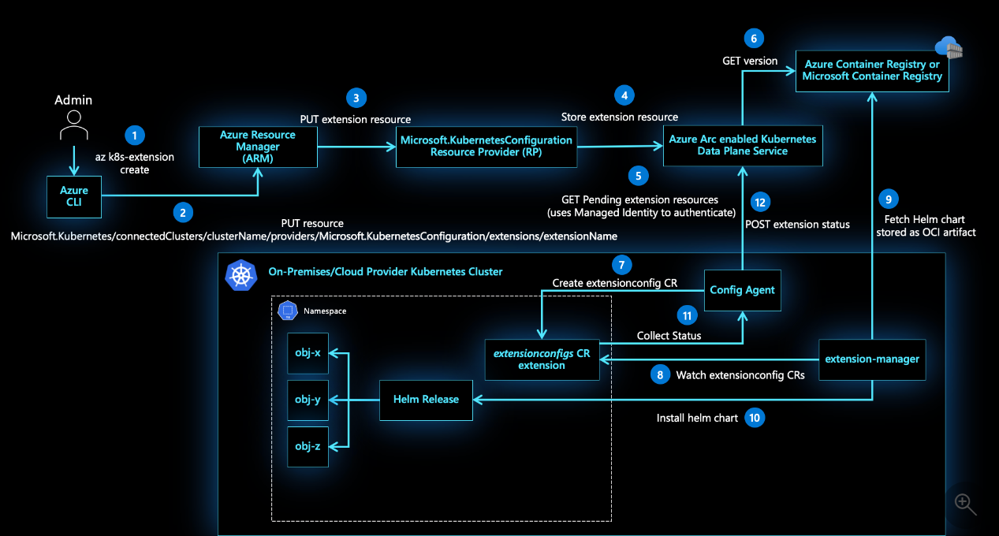

More information on cluster extensions:  
https://learn.microsoft.com/en-us/azure/azure-arc/kubernetes/conceptual-extensions

#### Available extensions

https://learn.microsoft.com/en-us/azure/azure-arc/kubernetes/extensions-release  

Azure Monitor Container Insights is one of them! 

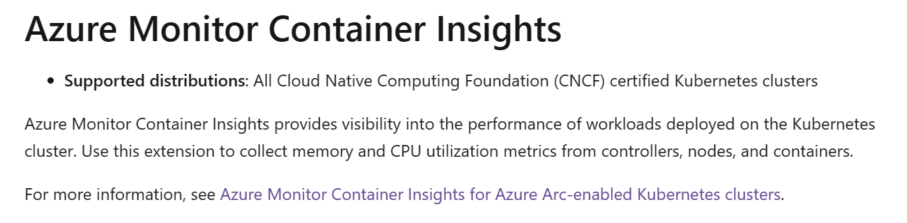

You may also want to consider **"Microsoft Defender for Containers"**   

---  

### Install cluster extension - Azure Monitor for Containers  

az k8s-extension create --name azuremonitor-containers --cluster-name arc4akstestcluster --resource-group arcrg --cluster-type connectedClusters --extension-type Microsoft.AzureMonitor.Containers --configuration-settings logAnalyticsWorkspaceResourceID="/subscriptions/xyz123abc-xyz123abc/resourceGroups/arcrg/providers/Microsoft.OperationalInsights/workspaces/arclogs"

Reference:   
https://learn.microsoft.com/en-us/azure/azure-monitor/containers/container-insights-enable-arc-enabled-clusters?tabs=create-cli%2Cverify-portal

--- 

### Install cluster extension - Azure Managed Workspace (Prometheus)  

https://learn.microsoft.com/en-us/azure/azure-monitor/containers/prometheus-metrics-from-arc-enabled-cluster?tabs=cli#create-an-extension-instance  

az k8s-extension create --name azuremonitor-metrics --cluster-name arc4akstestcluster --resource-group arcrg --cluster-type connectedClusters --extension-type Microsoft.AzureMonitor.Containers.Metrics --configuration-settings azure-monitor-workspace-resource-id="/subscriptions/xyz123abc-xyz123abc/resourceGroups/arcrg/providers/microsoft.monitor/accounts/arcmetrics" grafana-resource-id="/subscriptions/xyz123abc-xyz123abc/resourceGroups/monitoringrg/providers/Microsoft.Dashboard/grafana/srinmangrana"

--- 


### Data Collection and Tools  

#### Logging - Dataplane (Nodes and pods)

When you enable Container Insights for your Kubernetes cluster, it deploys a containerized version of the Azure Monitor agent that sends data to a Log Analytics workspace in Azure Monitor. Container insights collects **container stdout/stderr** , infrastructure logs, and performance data. All log data is stored in a Log Analytics workspace where they can be analyzed using Kusto Query Language (KQL).  

https://learn.microsoft.com/en-us/azure/azure-monitor/containers/monitor-kubernetes#enable-container-insights-for-collection-of-logs

#### Metrics - Dataplane (Nodes and pods)

https://learn.microsoft.com/en-us/azure/azure-monitor/containers/monitor-kubernetes#enable-scraping-of-prometheus-metrics  


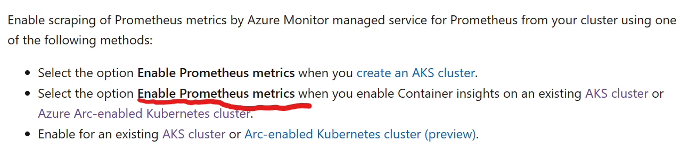


#### Disable metrics collection with logging  

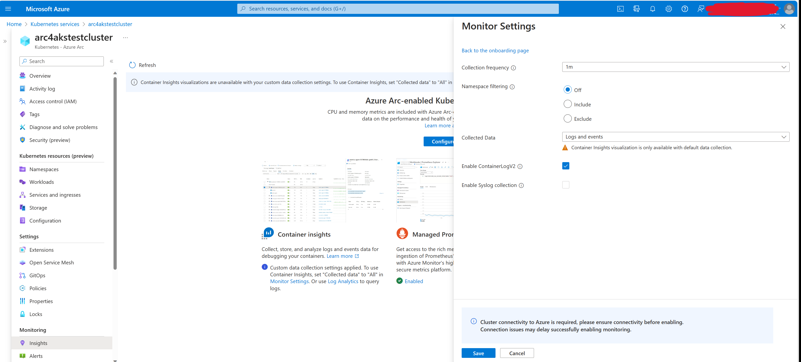

#### Logging - Control plane  (API server, scheduler, controller manager, etcd)

The logs for AKS control plane components are implemented in Azure as resource logs. 

https://learn.microsoft.com/en-us/azure/azure-monitor/containers/monitor-kubernetes#collect-control-plane-logs-for-aks-clusters  

##### AKS 

https://learn.microsoft.com/en-us/cli/azure/monitor/diagnostic-settings?view=azure-cli-latest#az-monitor-diagnostic-settings-create  


##### Openshift 

Need to follow up for capturing control plane data since it's different from AKS.

--- 


### View arc4akstestcluster cluster in Azure portal


###  View detailed consumption of log analytics workspace  

Open Log analytics resource in portal 
Click Workbooks  

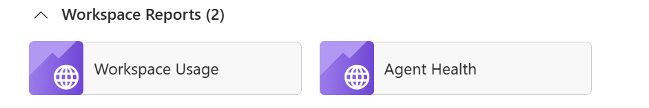  

Use TimeRange to select time period of interest.  

Following shows snapshot of usage within the last 15 minutes.  
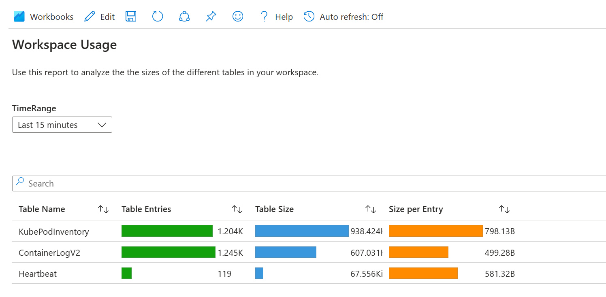

No performance data collection is enabled.  
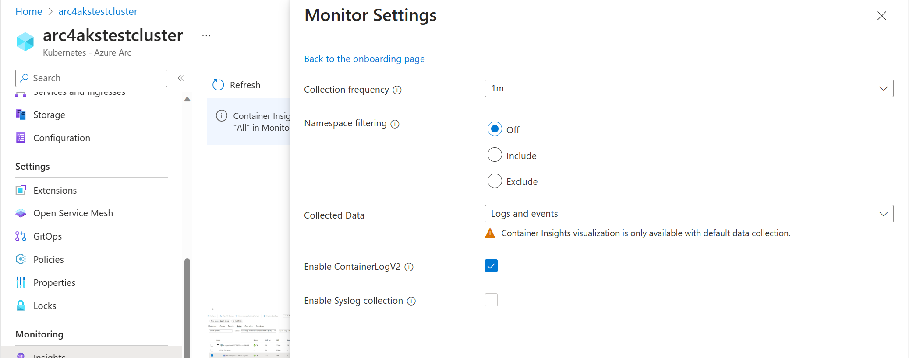  

Past 7 days show very high Perf usage.  
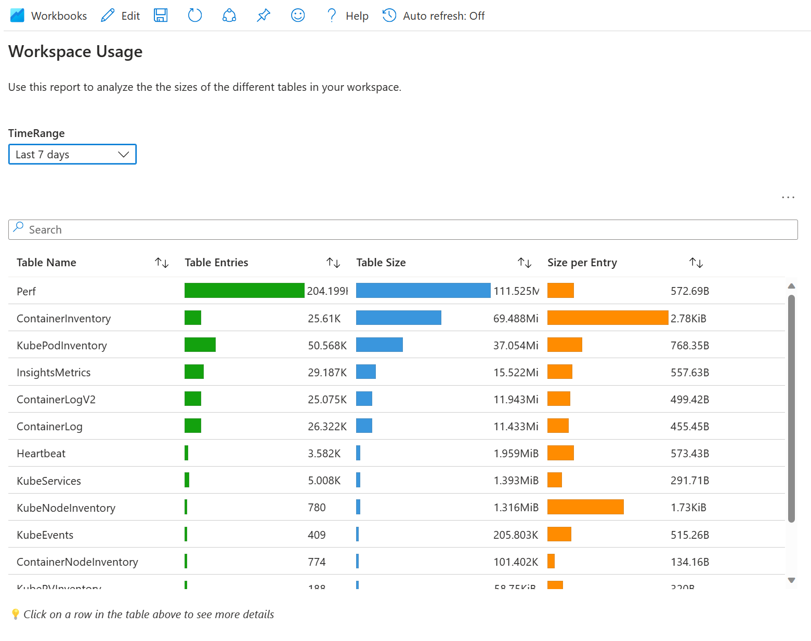  

Following is 'Log Analytics Workspace Insights - Overview' 
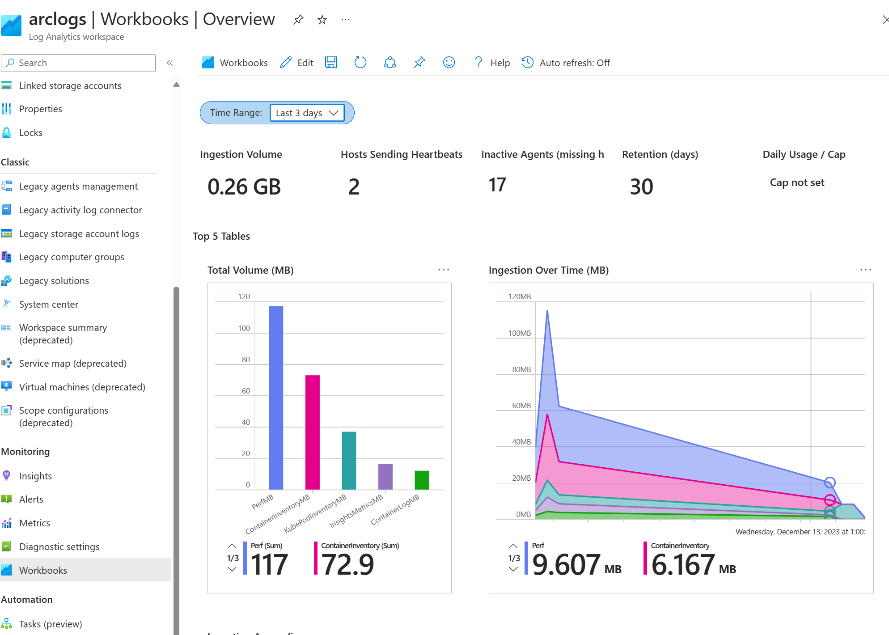  
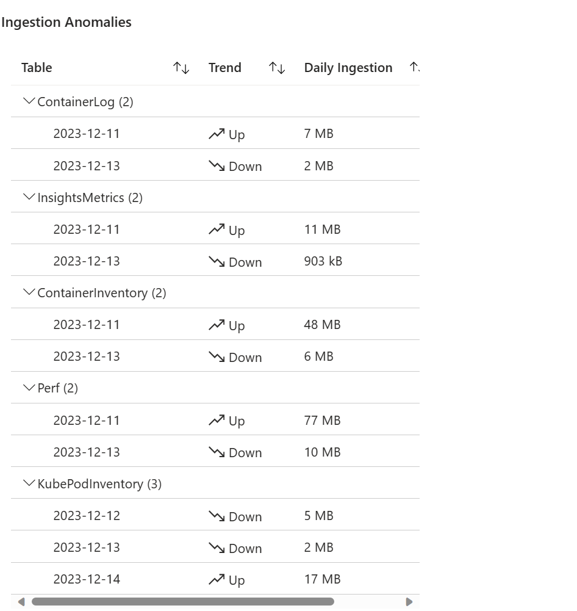  

Following is 'Log Analytics Workspace Insights - Insights view -> Usage'
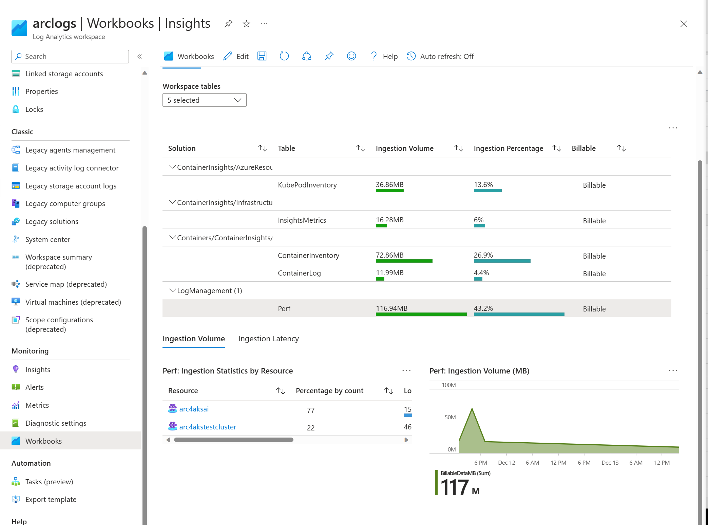  

### View Metrics 

Azure Monitor workspaces
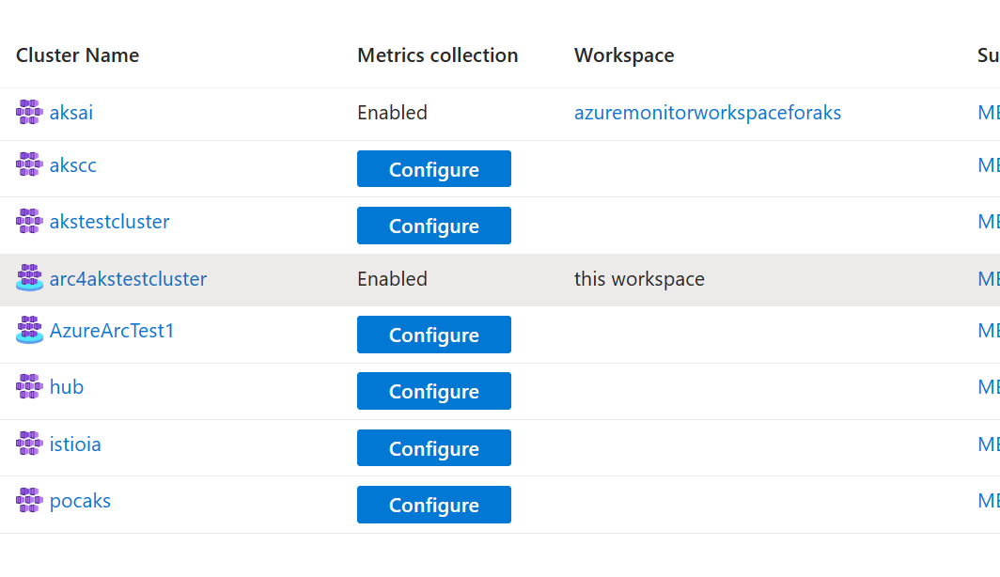   

Click 'Linked Grafana Workspaces'  
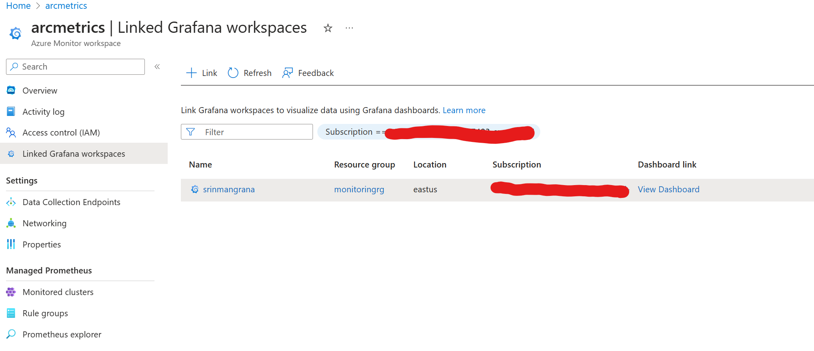  

Click 'View Grafana Dashboard'


Click any dashboard under 'Managed Prometheus'  
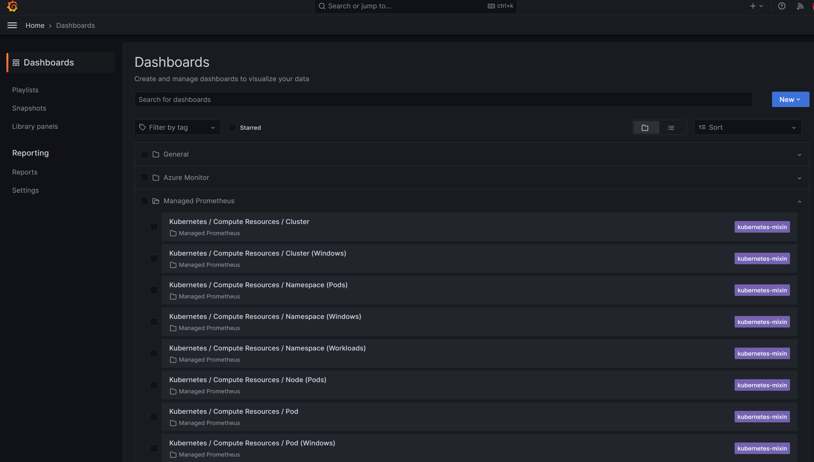  

Change 'Data source' to right resource.   
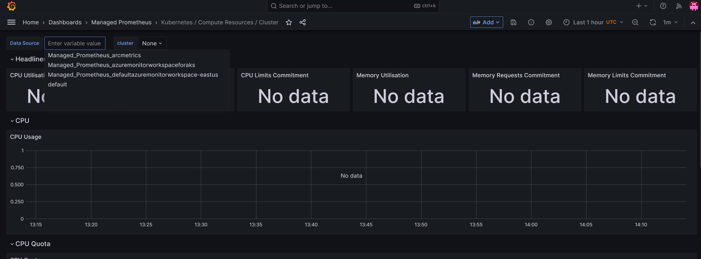 

Use this dashboard to view workload metrics.  
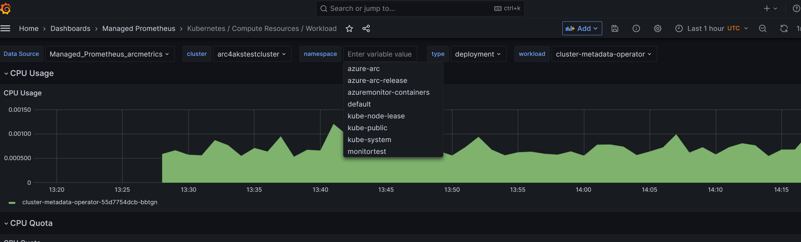
Any new workload/namespace should appear here.    
Create new workload in new namespace and view metrics.  
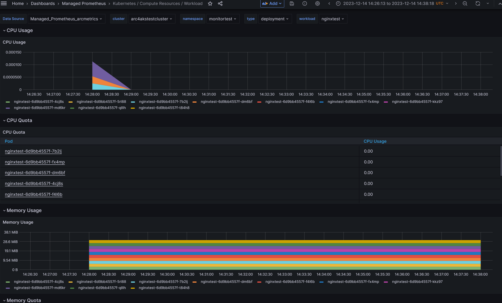  


### View Logging 

```
ContainerLogV2
| where PodNamespace == "monitortest" //update with target namespace
| project TimeGenerated, Computer, ContainerId, LogMessage, LogSource
```

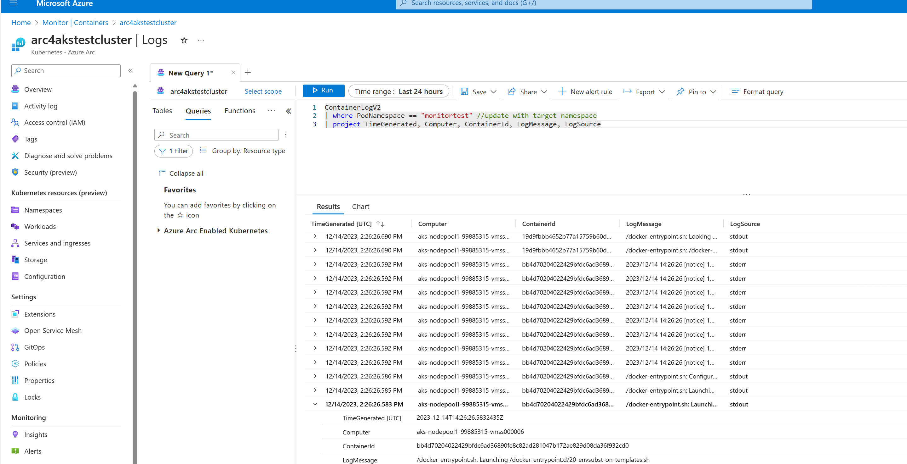


More examples:   
https://learn.microsoft.com/en-us/azure/azure-monitor/containers/container-insights-log-query#example-log-queries