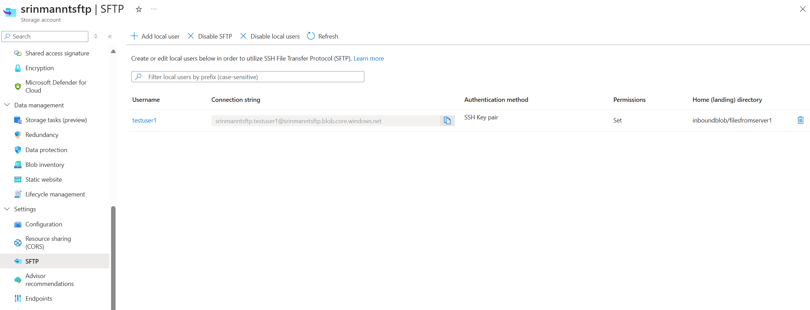
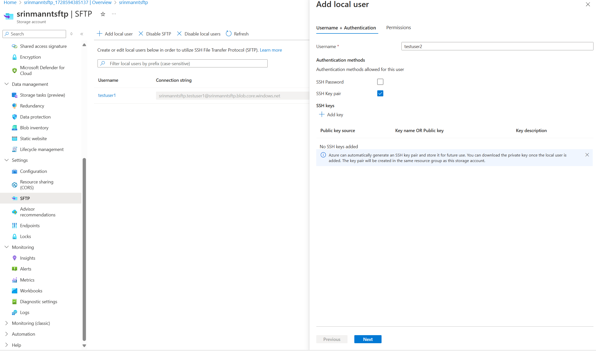
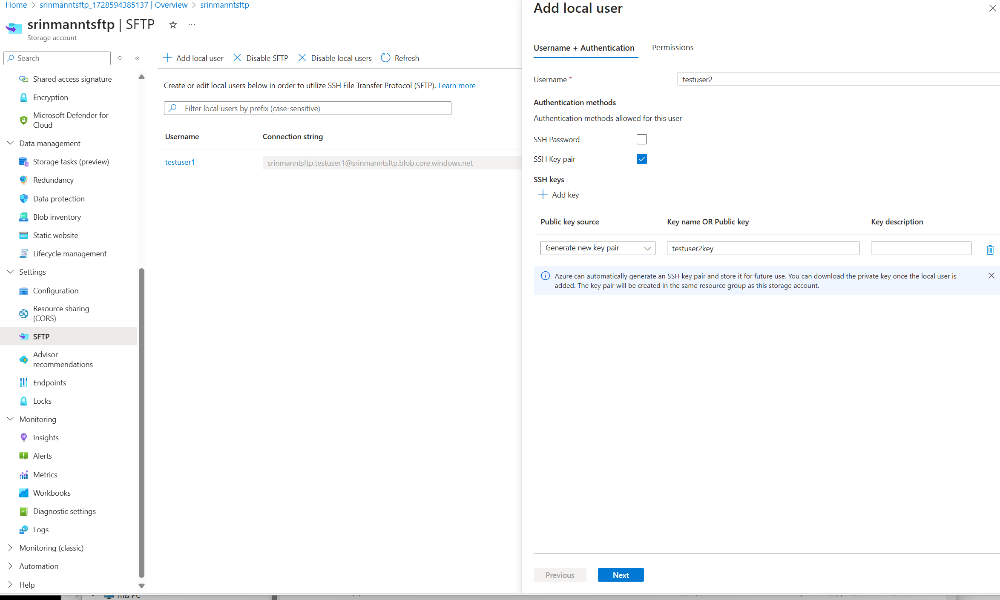
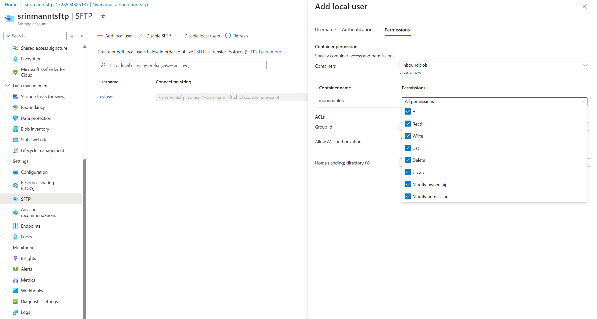
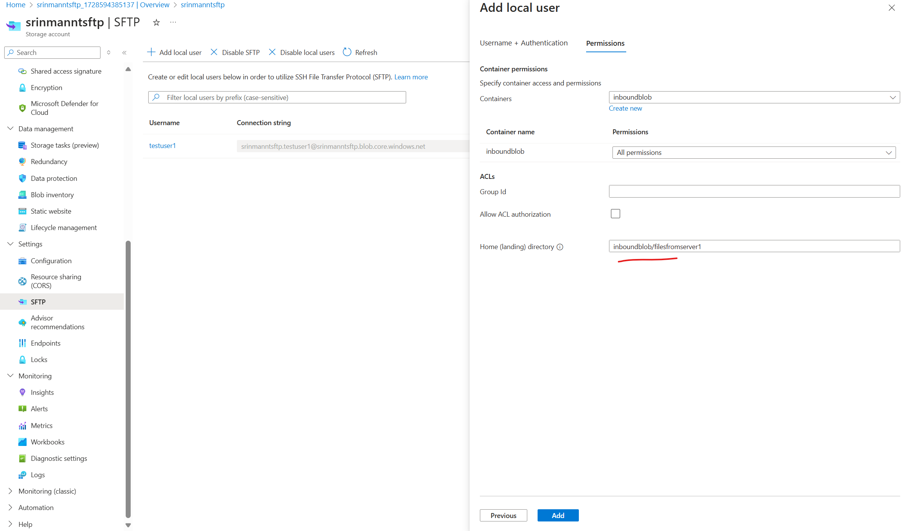
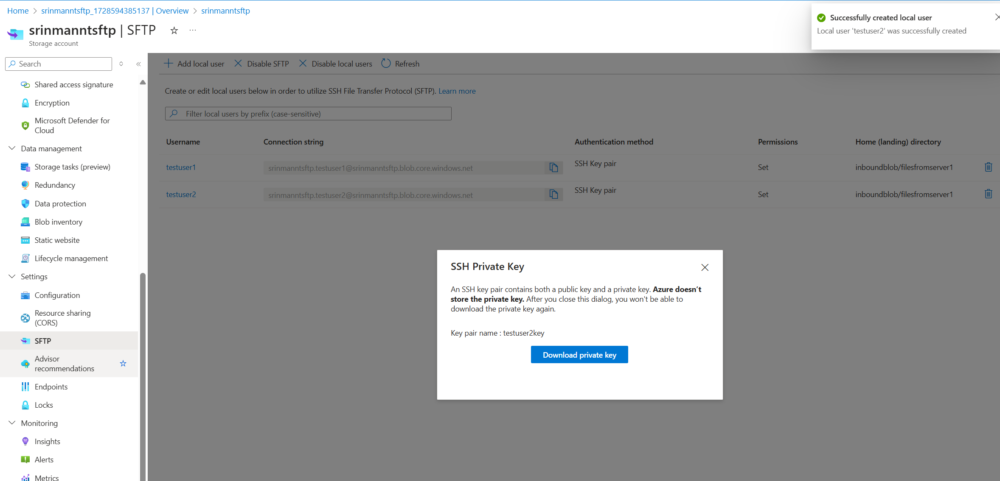
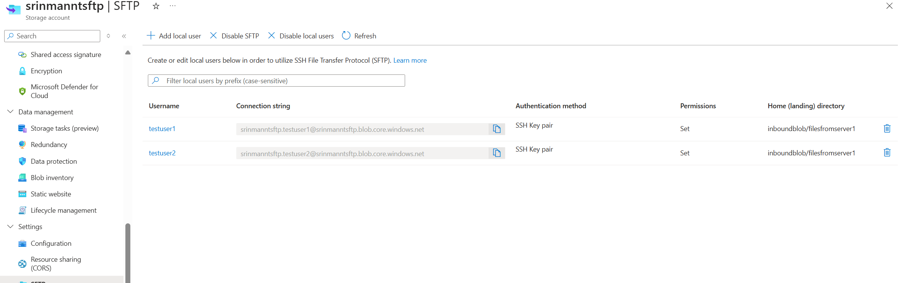
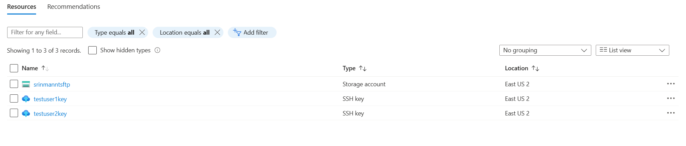

#  Leveraging SFTP feature of Azure Storage Account

## Introduction

Azure Storage Account is a cloud storage solution that provides a wide range of storage services. One of the lesser-known features of Azure Storage Account is the ability to use it as an SFTP server. This feature allows you to securely transfer files to and from your storage account using the SFTP protocol.

In this article, we will explore how to set up an SFTP server using Azure Storage Account and how to transfer files to and from the server.

## Prerequisites

Before we get started, you will need the following:

- An Azure subscription
- An Azure Storage Account
- An SFTP client  

## Setting up an SFTP server using Azure Storage Account

To set up an SFTP server using Azure Storage Account, follow these steps:

https://learn.microsoft.com/en-us/azure/storage/blobs/secure-file-transfer-protocol-support  

**Important: SFTP support requires hierarchical namespace to be enabled.**   

