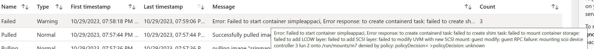

# Confidential Containers on ACI - Using CCE policy to verify integrity of container image

<!---

https://github.com/srinman/azureexamplespriv/blob/main/confcompute/aciconfidentialcomputing.md

--->

## Introduction

Confidential containers on Azure Container Instances protect data-in-use and encrypts data being used in memory.  An important step in implementing confidential computing is generating a CCE policy. CCE policies can also be used to verify the integrity of the container image and the runtime environment, even if there is no sensitive data. For eg, if you want to verify that the container image has not been modified, you can use CCE policy to verify the integrity of the container image. ACI is a fully managed serverless container platform that supports deploying a simple containerized application without a full blown orchestrator such as AKS.


## Prerequisites

Microsoft Azure Command-Line Tools Confidential Container Security Policy Generator Extension
Install confcom extension for Azure CLI 

az extension list-available -o table | grep confcom   
az extension add --name confcom  
az extension update --name confcom  

## Steps

Use filename aciconfidentialcomputingtemplate.json for this exercise (it's in steps below)

- Create ARM template for ACI with two important properties
    - confidentialComputeProperties
    - sku


### confidentialComputeProperties

The confidentialComputeProperties object enables you to pass in a custom confidential computing enforcement policy for attestation of your container group. If this object isn't added to the resource there will be **no validation** of the software components running within the container group.

- "confidentialComputeProperties": {
    "ccepolicy": "LEAVETHISBLANKNOW",
}

### sku

- "sku": "Confidential"

### Create a Confidential Container Security Policy

#### Update template with ccePolicy 

Let's check ccePolicy in the template.json file.  It should be blank.   

```
cp aciconfidentialcomputingtemplate_blankccepolicy.json aciconfidentialcomputingtemplate.json
cat aciconfidentialcomputingtemplate.json  | grep ccePolicy 
```   

Let's issue this command to update the template with ccePolicy.  This command overwrites ccepolicy in the json file.  

```
az confcom acipolicygen -a aciconfidentialcomputingtemplate.json 

cat aciconfidentialcomputingtemplate.json  | grep ccePolicy  
``` 


or  

alternatively show this file in vscode and search for ccePolicy.  You should see a long string.  


### Deploy ACI


```
az deployment group create --resource-group acirg --template-file aciconfidentialcomputingtemplate.json
```

If it fails, refresh local image. You may have seen "Using local version of youracrname.azurecr.io/simpleapp:v1. It may differ from the remote image"  while creating ccepolicy
use docker rmi image:tag
az confcom acipolicygen -a aciconfidentialcomputingtemplate.json 
You should see this message. 
youracrname.azurecr.io/simpleapp:v1 is not found locally. Attempting to pull from remote...

Use portal, navigate to container and try to 'Connect'. It should fail. 

## Validate deployment after hacking image!


for testing, let's use https://github.com/srinman/simpleapp

use Azure shell which makes it easier to make this change and use az acr build to build the image and push to ACR.  

git clone https://github.com/srinman/simpleapp
cd simpleapp
change app.py to use indexv1hacked.html 

az acr login --name regname --expose-token
docker login youracr.azurecr.io  -u 00000000-0000-0000-0000-000000000000 -p <token>   

az acr build --registry youracrname.azurecr.io --image simpleapp:v1 .

This command builds image with changed code and pushes image to same repo and with same tag (basically overwrites the image).

Let's restart ACI and see if it works.  

Use portal (CLI is also possible)

You should be able to see a failure message like this below.


This is because ccepolicy is not allowing the image to run.  

Let's delete the ACI and redeploy with deploy command. Please understand that we haven't touched the template.  We are just redeploying the same template - referring the same image. However, the image has changed.


```
az deployment group create --resource-group acirg --template-file aciconfidentialcomputingtemplate.json
```
Deployment should fail since ccepolicy detects change in image and fails the deployment.  


However, we can continue to deploy this image without CCE policy.  Use portal to deploy ACI with the same image name.  You should be able to see the app running with HACKED with red background.

This command overwrites simpleapp:v1 with good image
az acr import --name srinmanmsdn --source youracrname.azurecr.io/simpleapp:v1clean -t youracrname.azurecr.io/simpleapp:v1


## References

https://learn.microsoft.com/en-us/azure/container-instances/container-instances-confidential-overview   

https://github.com/Azure/azure-cli-extensions/blob/main/src/confcom/azext_confcom/README.md


