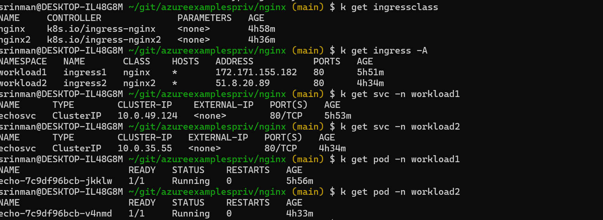
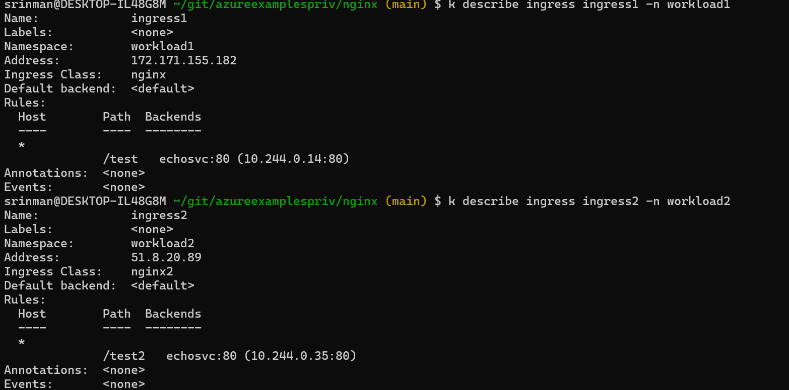

# Nginx OSS way  - how to install two NGINX ingress controllers in AKS  

## Install NGINX with HELM  

Reference link:   
https://github.com/MicrosoftDocs/azure-docs/blob/main/articles/aks/ingress-basic.md 

https://github.com/kubernetes/ingress-nginx/tree/main/charts/ingress-nginx  

```
NAMESPACE=nsingress1

helm repo add ingress-nginx https://kubernetes.github.io/ingress-nginx
helm repo update

helm install ingress-nginx ingress-nginx/ingress-nginx \
  --create-namespace \
  --namespace $NAMESPACE \
  --set controller.service.annotations."service\.beta\.kubernetes\.io/azure-load-balancer-health-probe-request-path"=/healthz \
  --set controller.service.externalTrafficPolicy=Local 

NAMESPACE=nsingress2

k create ns nsingress2 

helm install ingress-nginx2 ingress-nginx/ingress-nginx \
  --namespace nsingress2 \
  --set controller.ingressClassResource.name=nginx2 \
  --set controller.ingressClass=nginx2 \
  --set controller.ingressClassResource.controllerValue="k8s.io/ingress-nginx2" \
  --set controller.ingressClassResource.enabled=true \
  --set controller.ingressClassByName=true \
  --set controller.service.annotations."service\.beta\.kubernetes\.io/azure-load-balancer-health-probe-request-path"=/healthz \
  --set controller.service.externalTrafficPolicy=Local  


k create ns workload1
k create ns workload2

k apply -f ./workload/ 

k apply -f ingress1.yaml 
k apply -f ingress2.yaml 

k get ingress -A  
```
  
  


Open any browser and use IPs for ingress1 and ingress2 to access the services.  

http://ingress1IP/testpathtoworkload1  
http://ingress2IP/testpathtoworkload2
